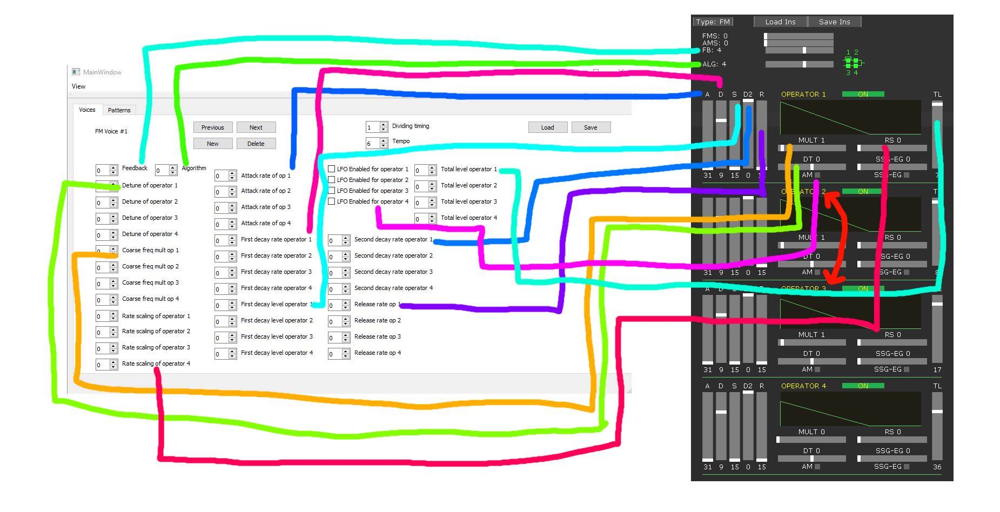

# Sonic 1 Music Gen

Tool for importing and exporting Sonic 1 SMPS music files, as well as ideally composing new music. No playback features are planned.

Sonic 1 stores its music in a format which has been labeled by romhackers as "SMPS", Sample Music Playback System. This format contains the following information:

* A general song header
* Specifics about which channels are in use. These channels are:
    * 6x FM (frequency modulation) and DAC (PCM playback?) on Yamaha YM2612
    * 3x PSG (Programmable Sound Generator) on SN76489
* Header for each channel
* Pattern information, much like in most music tracker formats
* FM voice synthesis table data

Details about the format can be found in the following places:
    * https://segaretro.org/SMPS/Headers
    * https://segaretro.org/SMPS/Voices_and_samples
    * http://info.sonicretro.org/SCHG:Music_Hacking/Pointer_and_Header_Format
    * http://info.sonicretro.org/SCHG:Music_Hacking/Voice_and_Note_Editing
    
### Compiling

* Get Qt Creator, version 5 or later
* Get a working modern compiler
    * qmake sonic1_music_gen.pro && make
    * alternatively open the .pro with Qt Creator, run qmake, compile

### Notes on usage

There are limitations as I haven't bothered coding full SMPS support

* FM pattern 1 must be a DAC channel. If you don't need it, write a single F2 coordinate flag in that pattern. When importing, this is done by default if FM channel 1 is empty.
* Hex code meanings in the patterns are in the file [hex.md](./hex.md)
* The FM voice parameters are complicated to use unless you are familiar with FM synthesis (I'm not). I recommend using [Deflemask](http://deflemask.com/) for creating instruments and then copying the instrument settings into this tool. However, since SMPS formats differ, there a few caveats:
    * Deflemask uses the format where operators are ordered 1,2,3,4 while Sonic 1 SMPS uses 1,3,2,4. So when copying FM voice settings from Deflemask into this tool, flip operators 2 and 3.
    * Currently detune can only be positive
    * I don't know what the FMS and AMS settings in Deflemask are
    * See the below image to see Deflemesk mappings into this tool. The unlinked controls aren't supported
    

### Known issues

* Using negative detune values with some combination of other flags causes a highpitched BEEEEEP to be played. I don't know what I do wrong with the signed/unsigned conversions.